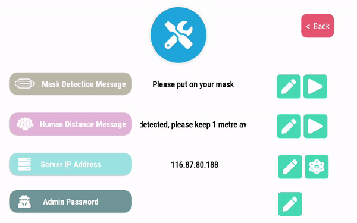

<!-- Heading--->
# TemiPatrol
<!-- Heading 2 -->
## About
This application is made for the detection of non-compliance of the mask wearing rule and at least one metre distancing between individuals in post Covid new normal

This application allows users to create routes from locations saved in the Temi robot and patrol the route created. 

Upon detection of non-compliance, Temi will broadcast an announcement and upload the image captured to the Drive.

<!-- Blockquote -->
>Backend Docker Containers for image processing were setup with a license provided by IMDA

---
## Temi Configurations
1. Stopping temi from following others 
   > Settings > Tracking User > OFF
2. Removing the display of the next location that Temi is going to
   > Settings > General Settings > Fullscreen navigation notification | Navigation status label > OFF

3. Disabling Interaction Button (Optional)
   > Settings > General Settings > Interaction Button > Disabled

---

## Sign In

Upon detecting that an image contains a person not wearing mask or clustering (< 1m apart), an image will be uploaded to the Google account that was logged in.

## App Configurations
**Set the IP Address of the server hosting the containers**

**Ensure that the Connection test passes in the Configurations Page**
> Do this by clicking on the button next to the edit Server IP button

App configurations:
- Mask Detection Message: Message broadcasted when a person not wearing mask is detected
- Human Distance Message: Message broadcasted when there is a group (> 1) of people standing less than 1 metre apart
- Server IP Address: IP address where images are sent to for processing (*where the mask detection and human distance module is hosted*)
- App master password - Master password for configuring application settings

## Route creation

Tap on the locations to add it to the route

- Patrol Count: Number of times Temi will patrol the route created

- Route: Sequence of locations taken by Temi during the patrol

### Removing a location

Swipe up or down on a inputted location to remove it

### Reordering a location

Hold and drag a location card to change it's position

## Stop Patrol

Tap on the Robosolutions icon 6 times to stop the patrol

---
## Acknowledgements 
<!-- Heading 3 -->
### Icons and art
- [FontAwesome](www.fontawesome.com)
- [Ouch Free Vector Illustrations](https://www.figma.com/community/file/843472672440914284)
### Libraries
- [Android Studio](https://developer.android.com/studio/intro)
- [Temi Sdk](https://github.com/robotemi/sdk/wiki)
- [Google Rest API](https://developers.google.com/android)
- [Camera View](https://github.com/natario1/CameraView)
- [Awesome Text Input Layout](https://github.com/anoop44/AwesomeTextInputLayout)
- [Ramotion Fluid Slider](https://github.com/Ramotion/fluid-slider)
- [Flat Dialog](https://github.com/mejdi14/Flat-Dialog-Android)
- [Fading Text View](https://github.com/rosenpin/fading-text-view)

---