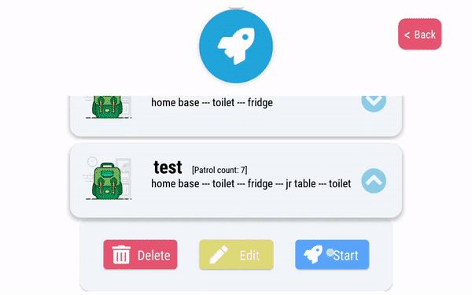

<!-- Heading--->
# TemiPatrol
<!-- Heading 2 -->
## About
Mask detection and human clustering detection applicaction made using Android Studio.

This application allows users to create routes from locations saved in the Temi robot and patrol the route created. 

Upon detecting that a person is not wearing a mask / clustering is detected, Temi will broadcast an announcement and upload the image captured to the Drive.

<!-- Blockquote -->
>Backend Docker Containers for image processing were provided by **IMDA**

---
## Configurations
1. Stopping temi from following others 
   > Settings > ...
2. Removing the display of the next location that Temi is going to
   > Settings > ...

---
## User Guide
[Signing In](sign-in)

[Route Creation](route-creation)

[Route Options](route-options)

[Stopping Patrol](stop-patrol)

[Configurations](configurations)

### Sign In

Upon detecting that an image contains a person not wearing mask or clustering (< 1m apart), an image will be uploaded to the Google account that was logged in.

### Route creation

Tap on the locations to add it to the route

- Patrol Count: Number of times Temi will patrol the route created

- Route: Sequence of locations taken by Temi during the patrol

#### Removing a location

Swipe up or down on a inputted location to remove it

#### Reordering a location

Hold and drag a location card to change it's position

### Stop Patrol

Tap on the Robosolutions icon 6 times to stop the patrol

---
## Acknowledgements 
<!-- Heading 3 -->
### Icons and art
- [FontAwesome](www.fontawesome.com)
- [Ouch Free Vector Illustrations](https://www.figma.com/community/file/843472672440914284)
### Libraries
- [Android Studio](https://developer.android.com/studio/intro)
- [Temi Sdk](https://github.com/robotemi/sdk/wiki)
- [Google Rest API](https://developers.google.com/android)
- [Camera View](https://github.com/natario1/CameraView)
- [Awesome Text Input Layout](https://github.com/anoop44/AwesomeTextInputLayout)
- [Ramotion Fluid Slider](https://github.com/Ramotion/fluid-slider)
- [Flat Dialog](https://github.com/mejdi14/Flat-Dialog-Android)
- [Fading Text View](https://github.com/rosenpin/fading-text-view)

---
## Future Extensions